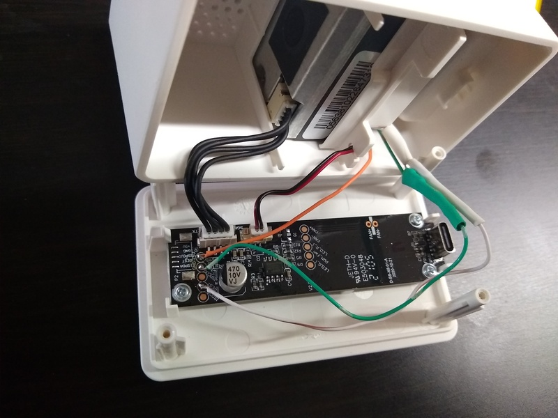
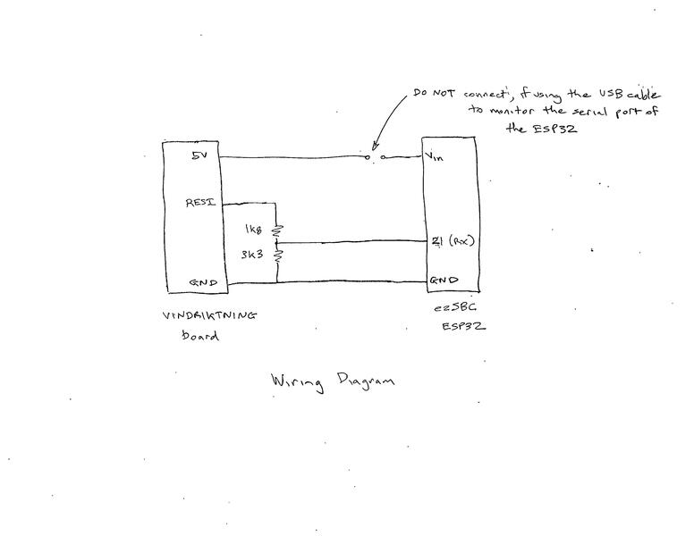
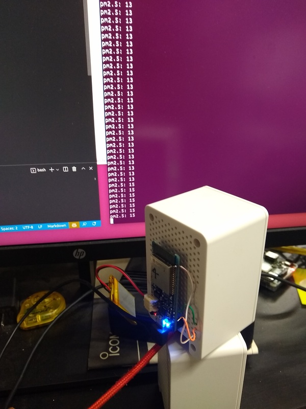
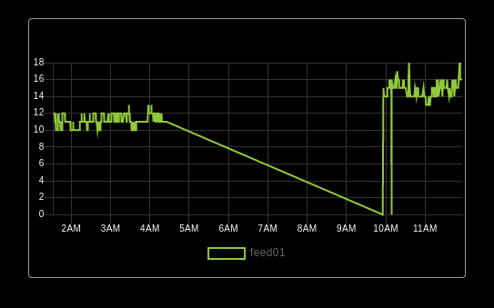

This small project demonstrates how to interface the [IKEA VINDRIKTNING](https://www.ikea.com/us/en/p/vindriktning-air-quality-sensor-60515911/) air quality monitor to an ESP32, running Toit.

The air quality sensor is read over a serial link by a microprocessor which drives a multi-color LED bar on the front of the monitor. Tapping the sensor output via the RX of the added [ezSBC](https://www.ezsbc.com/product/esp32-feather/) board, it is possible to collect data without otherwise interfering with the monitor. **NOTE** the monitor circuitry is at 5V, which will damage the ESP32 input, so a simple voltage divider is used to reduce the voltage, as shown in the wiring diagram below.  In the photo, the two resistors are buried in the heat shrink.



Connections  



Wiring Diagram  

The third link below gives a good description and photos of how to mechanically tap into the existing circuitry (although here the ESP32 was mounted externally). It is stated that the monitor uses a "Cubic PM1006-like" sensor and Arduino code is provided to interface to it. The Toit code here does a blocking read of the serial port, checks the frame length, header and checksum, then extracts the air quality reading from the frame.  The frame layout matchs the information shown in the datasheet.  

For development purposes, the serial monitor to the ESP32 was used as shown on the console output below.  Since the VINDRIKTNING is permanently USB powered, it would be possible to add MQTT monitoring over WiFi and take 5V for the ESP32 from the air quality monitor board (after removing the ESP32 USB serial monitor cable, to avoid 5V rail conflicts).

  

Output

Sitting on the desk, the air quality LED bar is green and the reading is ~13ppm.  Rubbing some facial tissue together close by generates a reading of 40ppm.  For something more dramatic (and dangerous), you can light the tissue and blow it out. The smoke yields a reading around 800ppm.

### Update 2023-03-15 ------------------------------
In v2.0.0, added support for reporting the data to io.adafruit.com (there is a usable free tier).  

For guidance on MQTT, refer to [Steve's Internet Guide](http://www.steves-internet-guide.com/) and for usage of MQTT in Toit, refer to the [MQTT tutorial](https://docs.toit.io/tutorials/mqtt).  

For a cloud based MQTT server, one of the simplest is io.adafruit.com.  Refer to the [Setup an account](https://accounts.adafruit.com/users/sign_up) instructions and the [Toit adafruit example](https://github.com/toitware/mqtt/blob/main/examples/adafruit.toit)

Then to this project, add a file called `credentials.toit` where you will declare:  
- login credentials provided as part of your account signup
- definitions as you configure your client/feed

Refer to the import in `main.toit`:  
```
import .credentials show ADAFRUIT_IO_USERNAME  ADAFRUIT_IO_KEY ADAFRUIT_IO_FEEDNAME CLIENT_ID

```
To check you are getting data to Adafruit, click the defined feed and you should see a graph and table of your data. You can then create a dashboard and add a Line Chart widget, yielding plots like:  



Reporting over MQTT, I disconnected the USB serial monitor to the ezSBC board and powered the board from the VINDRIKTNING, leaving the LiPo connected to help with the power surges during WiFi transmit.

To provide some local indication of status, the RED led is flashed:
- 50mS, after each valid frame received serially from the sensor
- 950mS, after each MQTT payload is transmitted over WiFi

(You have to watch the `led_status.mp4` video to the very end to see the transmit indication)

### References:
1. [Datasheet](http://www.jdscompany.co.kr/download.asp?gubun=07&filename=PM1006_LED_PARTICLE_SENSOR_MODULE_SPECIFICATIONS.pdf)
2. [PM1006 Particulate Matter Sensor](https://esphome.io/components/sensor/pm1006.html)
3. [esp8266-vindriktning](https://github.com/Hypfer/esp8266-vindriktning-particle-sensor)